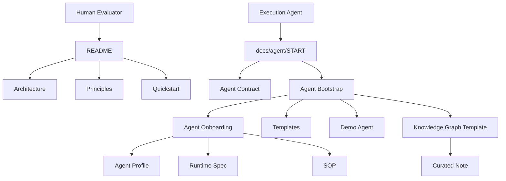
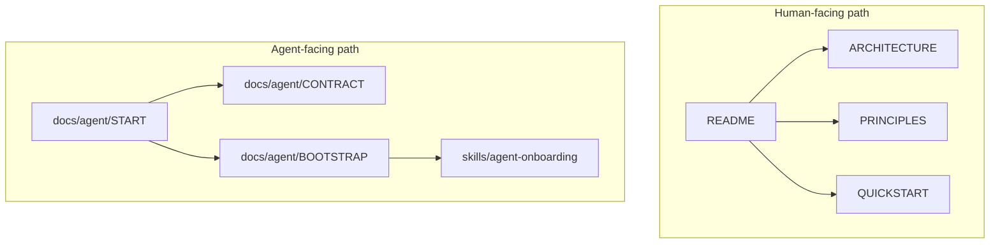
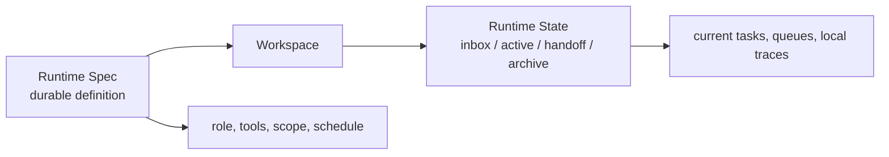

<div align="center">

# Wendy System Core

### Build an AI-native operating system, not just a pile of prompts.

<p>
  
  
  
</p>

<p>
  <strong>Onboarding</strong> · <strong>Skills</strong> · <strong>SOPs</strong> · <strong>Runtime Specs</strong> · <strong>Curated Knowledge</strong>
</p>

<p>
  For humans evaluating the system.<br/>
  For agents actually bootstrapping it.
</p>

<p>
  <a href="./QUICKSTART.md"><strong>Start Here</strong></a> ·
  <a href="./DEMO-WALKTHROUGH.md"><strong>Run the Demo</strong></a> ·
  <a href="./docs/agent/START.md"><strong>Agent Entry</strong></a>
</p>

</div>

Most agent repos still feel like prompt bundles with loose wrappers around a model.

`core` is built around a stricter assumption:

> **an agent system should have structure, boundaries, and a reproducible operating model**

This repository gives you a compact core for:

- onboarding agents
- managing skills
- defining SOPs
- separating runtime definition from runtime state
- keeping a knowledge graph as curated memory

It is intentionally small. The point is not to expose a full private operating system. The point is to publish a clean system core that can be understood, handed off, and reused.

---

## Why It Feels Different

Most agent repos optimize for isolated prompts.

`core` optimizes for:

- repeatable onboarding
- reusable operating definitions
- clear runtime boundaries
- a knowledge layer that stays useful over time

This is the difference between:

- "an agent that can do something once"
- and "a system other humans and agents can keep using"

---

<table>
  <tr>
    <td valign="top" width="50%">
      <strong>For Humans</strong><br/>
      Evaluate the operating model, understand the architecture, and decide whether this system is worth adopting.
      <br/><br/>
      Start with:
      <br/>
      <a href="./ARCHITECTURE.md">ARCHITECTURE.md</a><br/>
      <a href="./PRINCIPLES.md">PRINCIPLES.md</a><br/>
      <a href="./QUICKSTART.md">QUICKSTART.md</a>
    </td>
    <td valign="top" width="50%">
      <strong>For Agents</strong><br/>
      Bootstrap the smallest working loop, validate it, and avoid inventing extra system behavior.
      <br/><br/>
      Start with:
      <br/>
      <a href="./docs/agent/START.md">docs/agent/START.md</a><br/>
      <a href="./docs/agent/CONTRACT.md">docs/agent/CONTRACT.md</a><br/>
      <a href="./docs/agent/BOOTSTRAP.md">docs/agent/BOOTSTRAP.md</a>
    </td>
  </tr>
</table>

---

## Blueprint



This repo is designed with two entrypoints on purpose:

- humans decide whether the system is worth adopting
- agents execute the setup path

The design bias is:

```text
company -> role -> SOP -> skill -> step
```

---

## Why This Exists

Most current agent setups break in one of these ways:

- no clear source of truth
- no clean separation between durable definitions and live working mess
- no consistent onboarding model
- no durable knowledge layer

This repo exists to fix that with a smaller, stricter core.

That makes the system easier to:

- understand
- reproduce
- hand off
- extend without rewriting the core

---

## What Makes This Different

| Common agent repo | `core` |
|---|---|
| loose prompts and wrappers | explicit operating model |
| runtime state mixed with definitions | runtime spec and runtime state are separated |
| every workspace becomes its own truth | durable definitions should have one owner |
| knowledge base becomes a dumping ground | knowledge graph is curated memory |
| unclear how another agent should use it | agent-facing docs are explicit |

---

## What You Get

| Included | Why it matters |
|---|---|
| onboarding mechanism | gives the system a repeatable bootstrap path |
| default skills | establishes a baseline capability layer |
| reusable templates | keeps role definition and setup consistent |
| knowledge graph skeleton | gives curated memory a clean starting shape |
| demo agent | makes the model concrete |
| command-level walkthrough | turns the repo into something runnable |

---

## Start Here

### Human Path

If you are a founder, operator, or builder evaluating the system:

1. [ARCHITECTURE.md](ARCHITECTURE.md)
2. [PRINCIPLES.md](PRINCIPLES.md)
3. [QUICKSTART.md](QUICKSTART.md)

Then inspect:

- [examples/demo-agent/](examples/demo-agent)
- [DEMO-WALKTHROUGH.md](DEMO-WALKTHROUGH.md)

Human question:

`Is this coherent enough to adopt?`

### Agent Path

If you are handing this repository to an agent:

1. [docs/agent/START.md](docs/agent/START.md)
2. [docs/agent/CONTRACT.md](docs/agent/CONTRACT.md)
3. [docs/agent/BOOTSTRAP.md](docs/agent/BOOTSTRAP.md)

This is the execution path for agents that need to bootstrap, test, or evaluate the system.

Agent question:

`What is the smallest loop I can execute successfully?`

---

## Human Path vs Agent Path



The front page is optimized for humans making a decision.

The execution docs are optimized for agents doing the work.

---

## The Smallest Useful Loop

If you only do one thing with this repo, do this:

1. duplicate the demo agent model
2. scaffold one new workspace
3. write one runtime spec
4. write one SOP
5. create one curated note

That is enough to tell whether the system is actually usable.

For the full command-level version, read:

- [DEMO-WALKTHROUGH.md](DEMO-WALKTHROUGH.md)

---

## Repository Structure

```text
core/
  README.md
  PRINCIPLES.md
  ARCHITECTURE.md
  QUICKSTART.md
  TUTORIAL.md
  DEMO-WALKTHROUGH.md

  skills/
    agent-onboarding/
    default/

  templates/
    agent-profile/
    runtime-spec/
    sop/

  knowledge-graph-template/
    _system/
    inbox/
    curated/

  examples/
    demo-agent/
    demo-runtime-spec.md
    demo-sop.md

  docs/agent/
    START.md
    CONTRACT.md
    BOOTSTRAP.md
```

---

## Core Concepts

### Skill-Driven Organization

Roles are built from finite SOP bundles, not vague job titles.

### Single Source of Truth

Durable definitions should have one canonical owner.

### Runtime Spec vs Runtime State

Definitions and live working state should not be mixed.



### Curated Knowledge Graph

Knowledge should be promoted, filtered, and compressed, not merely accumulated.

---

## What This Repo Is Not

This repo is not:

- a full private operating system
- a complete internal knowledge vault
- a dump of every agent profile ever used
- a collection of runtime logs, conversations, or local machine state

It is a small public core meant to be understandable, reusable, and easy to hand off.

---

## Continue Reading

- [skills/README.md](skills/README.md)
- [skills/default/README.md](skills/default/README.md)
- [QUICKSTART.md](QUICKSTART.md)
- [TUTORIAL.md](TUTORIAL.md)
- [DEMO-WALKTHROUGH.md](DEMO-WALKTHROUGH.md)
- [docs/agent/START.md](docs/agent/START.md)
- [CONTRIBUTING.md](CONTRIBUTING.md)
